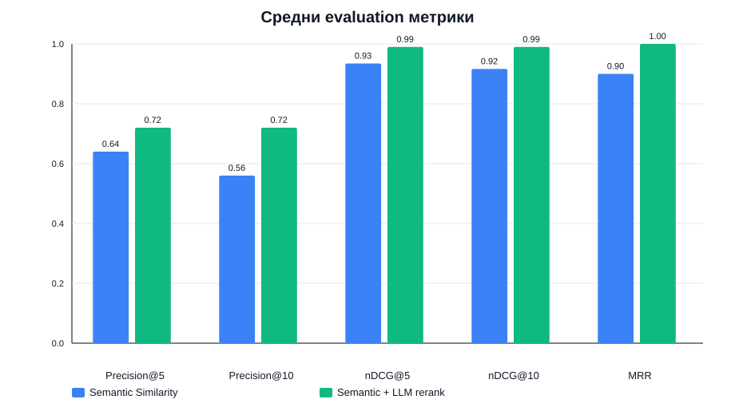
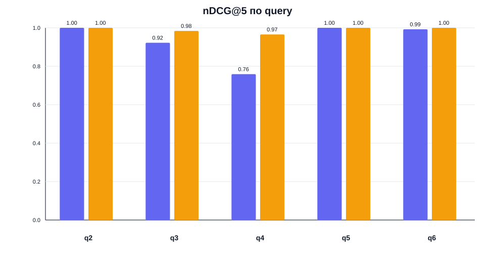
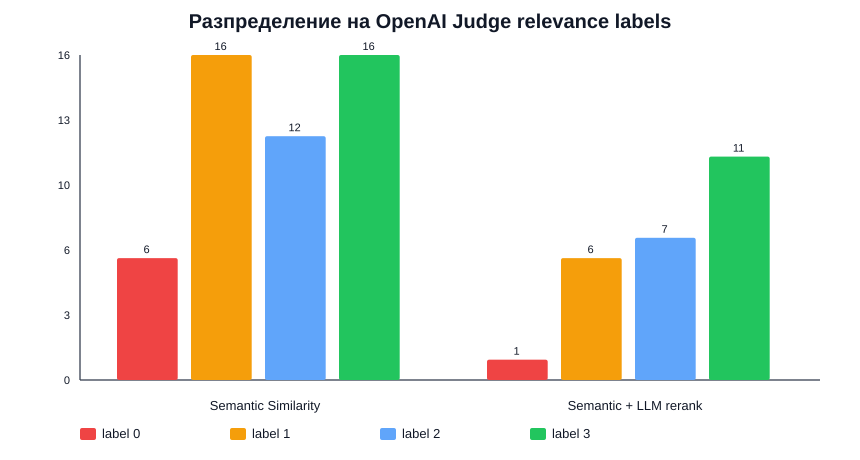
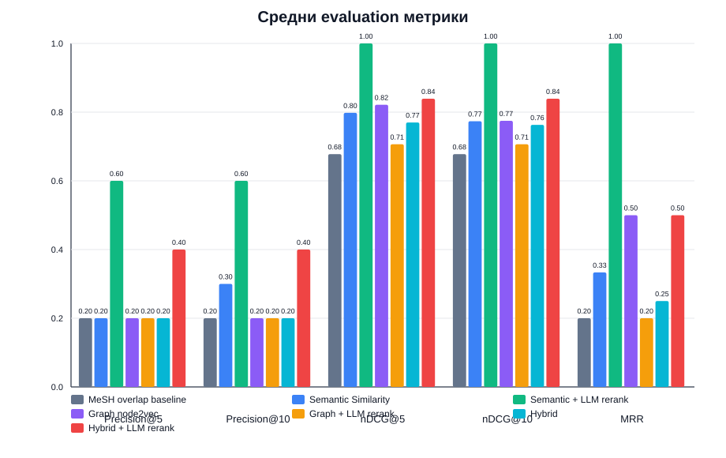
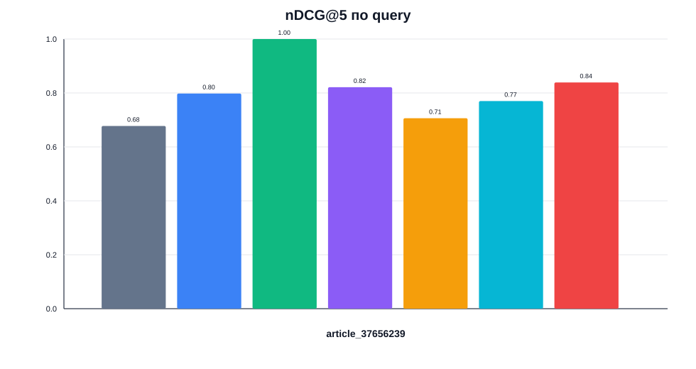
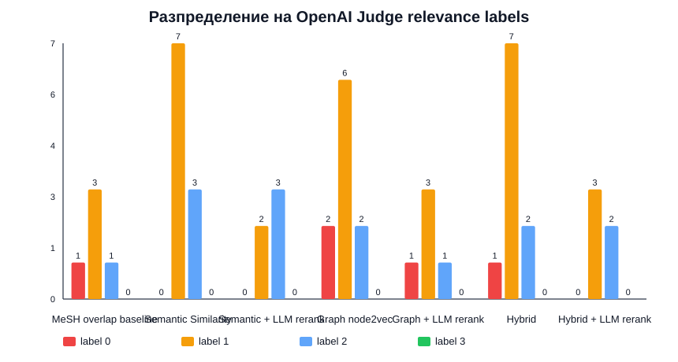

# Документация на проекта: NutriEvidence Agent

## 1. Резюме / Абстракт

**NutriEvidence Agent** е образователна препоръчваща система за биомедицинска научна литература. Проектът има за цел да подпомага студенти, изследователи и потребители с научен интерес при откриване на релевантни публикации от PubMed по въпроси, свързани с хранене, обществено здраве, неврология и биомедицински теми.

Системата извлича статии от PubMed, съхранява ги локално, обработва заглавията и резюметата им, създава семантични представяния чрез sentence-transformer модел и препоръчва най-релевантните публикации чрез similarity-based подход. Като разширение системата изгражда Article–MeSH knowledge graph, обучава node2vec графови ембединги и използва графова близост за допълнително препоръчване на статии. Проектът включва и локален LLM слой чрез **Ollama + Llama 3.1 8B**, който се използва за анализ на потребителския въпрос, извличане на evidence елементи, обяснение на препоръките, reranking на кандидат-статии и safety проверка на финалния отговор.

Проектът включва и реализиран **OpenAI Judge** компонент за оценяване на релевантността на препоръчаните статии. Този компонент не участва в основното препоръчване и не се използва като медицински източник на истина. Неговата роля е да подпомага evaluation процеса чрез автоматично присвояване на relevance labels по скала 0–3, които по-късно могат да бъдат ръчно проверени и коригирани.

Проектът **не е медицинска диагностична система**. Той не поставя диагнози, не препоръчва лечение и не замества медицински специалист. Основната му цел е да бъде **research assistant** за намиране, подреждане, обобщаване и оценяване на релевантността на научна литература.

---

## 2. Проблем, който проектът решава

PubMed съдържа огромно количество биомедицински публикации. При търсене по дадена тема потребителят често получава голям брой резултати, които трудно се преглеждат ръчно. Това създава няколко проблема:

- трудно е бързо да се открият най-релевантните статии;
- резултатите от търсачката невинаги са подредени според конкретния изследователски въпрос;
- потребителят трябва сам да прецени кои публикации са review, systematic review, clinical trial или observational study;
- липсва кратко обяснение защо дадена статия е релевантна;
- при медицински теми е важно системата да не генерира неподкрепени твърдения или медицински съвети.

Проектът решава този проблем чрез комбиниране на:

1. **PubMed retrieval** — извличане на реални публикации и метаданни;
2. **Semantic similarity recommender** — препоръчване на статии чрез embedding близост между потребителския въпрос и title + abstract;
3. **Knowledge graph recommender** — представяне на статии и MeSH термини като граф и използване на node2vec embeddings;
4. **Hybrid recommender** — комбиниране на semantic и graph-based резултати;
5. **Local LLM agentic layer** — използване на локален Llama модел за query planning, evidence extraction, reranking, explanations и safety checking;
6. **Evaluation module** — изчисляване на Precision@K, nDCG@K и MRR върху ръчно или OpenAI Judge-assisted оценени препоръки.

---

## 3. Основна цел на проекта

Основната цел е да се разработи **agentic RAG-based recommender system** за биомедицинска литература, която:

- приема потребителски научен въпрос;
- извлича или използва кеширани PubMed статии;
- подрежда публикации според релевантност;
- препоръчва Top K статии;
- обяснява защо са препоръчани;
- обобщава evidence от намерените публикации;
- използва локален LLM модел за подпомагане на анализа, без да генерира неподкрепени медицински твърдения.

---

## 4. Какво представлява RAG в проекта

RAG означава **Retrieval-Augmented Generation**. В контекста на проекта това означава, че LLM моделът не отговаря само от собствените си предварително научени знания. Вместо това системата първо извлича релевантни PubMed публикации, подрежда ги чрез recommender алгоритми и чак след това подава най-релевантните статии като контекст към локалния LLM.

Общият процес е:

```text
Потребителски въпрос
↓
Query Planner Agent
↓
PubMed retrieval / cached dataset
↓
Semantic recommender + graph recommender
↓
Top K релевантни статии
↓
LLM summary + explanations + safety checking
```

По този начин отговорът е grounded върху реални статии и метаданни, а не върху свободна генерация от LLM.

---

## 5. Основни стъпки за решаване на проблема

### 5.1. Събиране на данни от PubMed

Първата стъпка е извличане на статии от PubMed чрез NCBI Entrez API. За всяка статия се съхраняват следните полета:

```text
PMID
title
abstract
year
journal
authors
publication_types
mesh_terms
doi
source_query
```

Статиите се кешират локално във файл:

```text
data/pubmed_articles.json
```

Това позволява приложението да работи и без постоянно извикване към PubMed API.

---

### 5.2. Предварителна обработка на статиите

След извличане на статиите се извършва preprocessing:

- премахване на празни или невалидни записи;
- нормализиране на whitespace;
- обединяване на `title` и `abstract` в едно поле `document_text`;
- гарантиране, че `mesh_terms` винаги е списък;
- подготовка на данните за embeddings и similarity ranking.

Примерно представяне:

```text
document_text = title + ". " + abstract
```

---

### 5.3. Semantic similarity recommender

Основният recommender в проекта е базиран на semantic similarity.

Използва се моделът:

```text
sentence-transformers/all-MiniLM-L6-v2
```

Той превръща всяка статия в embedding вектор на база `title + abstract`. Потребителският въпрос също се превръща в embedding. След това се изчислява cosine similarity между въпроса и всяка статия.

Общ процес:

```text
User query
↓
Query embedding
↓
Article embeddings
↓
Cosine similarity
↓
Top K recommended articles
```

Този подход е избран като основен, защото е лесен за имплементация, не изисква потребителски профили и е подходящ за content-based recommendation.

---

### 5.4. MeSH overlap baseline

Като базов метод за сравнение се използва MeSH overlap recommender. Той измерва сходството между две статии чрез Jaccard similarity върху техните MeSH термини.

Формула:

```text
similarity(A, B) = |MeSH(A) ∩ MeSH(B)| / |MeSH(A) ∪ MeSH(B)|
```

Този baseline е важен, защото позволява да се провери дали semantic embeddings дават по-добри препоръки от простото съвпадение на контролирани медицински термини.

---

### 5.5. Knowledge graph и node2vec recommender

Като разширение към проекта се изгражда Article–MeSH knowledge graph.

Възли:

```text
Article
MeSHTerm
```

Ребра:

```text
Article --hasMeSHTerm--> MeSHTerm
```

Пример:

```text
article:12345678 --hasMeSHTerm--> mesh:cerebral_palsy
article:12345678 --hasMeSHTerm--> mesh:nutritional_status
article:12345678 --hasMeSHTerm--> mesh:child
```

След това върху графа се обучава node2vec модел, който създава графови embeddings за възлите. Използват се само embeddings на article възлите, защото те са обектите, които системата препоръчва.

Графовият recommender намира най-близките статии по cosine similarity между node2vec embeddings.

---

### 5.6. Hybrid recommender

Hybrid recommender комбинира резултатите от semantic recommender и graph recommender.

Примерна формула:

```text
final_score = 0.6 * semantic_score + 0.4 * graph_score
```

Ако graph recommender не е наличен, системата трябва да може да работи само със semantic recommender.

---

### 5.7. Local LLM layer чрез Ollama и Llama 3.1 8B

Проектът използва локален LLM модел като задължителен MVP компонент:

```text
Ollama
llama3.1:8b
```

LLM моделът се използва за:

- анализ на потребителския въпрос;
- извличане на PICO/PECO елементи;
- генериране на PubMed query;
- извличане на evidence от title и abstract;
- обяснение на препоръките;
- reranking на Top N кандидат-статии;
- генериране на кратко evidence summary;
- safety checking.

Важно ограничение: LLM не трябва да измисля статии, диагнози или медицински съвети. Той работи само върху вече извлечени статии и подадени metadata.

---

## 6. Дефиниране на хипотези

В проекта могат да бъдат формулирани следните хипотези. На този етап те са проектни хипотези, а по-късно ще бъдат проверени експериментално чрез evaluation частта.

---

### Хипотеза H1: Semantic similarity е подходящ основен метод за препоръчване на PubMed статии

**Твърдение:**  
Embedding-based semantic similarity върху `title + abstract` ще връща релевантни статии за даден потребителски биомедицински въпрос.

**Аргументация:**  
Заглавието и abstract-ът съдържат основната информация за статията. Sentence-transformer embeddings могат да улавят семантична близост дори когато думите не съвпадат напълно.

**Очакван резултат:**  
Semantic recommender трябва да постига приемливи стойности на Precision@5 и nDCG@5.

**Критерий за отхвърляне:**  
Хипотезата може да бъде отхвърлена, ако Top 5 резултатите често са слабо релевантни или нерелевантни според ръчна и/или OpenAI Judge-assisted annotation.

---

### Хипотеза H2: Semantic similarity ще бъде по-добър метод от MeSH overlap baseline

**Твърдение:**  
Semantic recommender ще връща по-добри резултати от прост baseline, базиран само на overlap между MeSH термини.

**Аргументация:**  
MeSH термините са полезни, но често са твърде общи. Semantic embeddings използват повече информация, защото вземат предвид title и abstract.

**Очакван резултат:**  
Semantic recommender трябва да има по-високи Precision@K и nDCG@K спрямо MeSH overlap baseline.

**Критерий за отхвърляне:**  
Ако MeSH overlap baseline consistently постига равни или по-добри резултати от semantic recommender, хипотезата се отхвърля.

---

### Хипотеза H3: Knowledge graph + node2vec добавя полезна структурна информация

**Твърдение:**  
Article–MeSH graph и node2vec embeddings могат да подобрят препоръките, защото улавят структурни връзки между статии и биомедицински понятия.

**Аргументация:**  
Две статии може да са свързани чрез общи или близки MeSH термини, дори когато текстовете им не са много сходни.

**Очакван резултат:**  
Graph recommender или hybrid recommender трябва да подобрява nDCG@5 или MRR спрямо само semantic similarity при част от query-тата.

**Критерий за отхвърляне:**  
Ако graph-based резултатите са системно по-слаби и hybrid моделът не добавя подобрение, хипотезата се отхвърля за текущия dataset.

---

### Хипотеза H4: LLM reranking подобрява качеството на финалните Top K препоръки

**Твърдение:**  
Локалният Llama модел може да подобри подреждането на Top 20 кандидат-статии, като избере най-подходящите Top 5 според population, exposure/intervention, outcome и тип на въпроса.

**Аргументация:**  
Semantic similarity изчислява близост на векторно ниво, но LLM може да направи по-структурирана преценка върху metadata, abstract snippet и publication type.

**Очакван резултат:**  
Semantic + LLM reranking или Hybrid + LLM reranking трябва да подобри nDCG@5 спрямо първоначалното алгоритмично подреждане.

**Критерий за отхвърляне:**  
Ако LLM reranking понижава Precision@5 или nDCG@5, или често избира по-слабо релевантни статии, хипотезата се отхвърля.

---

### Хипотеза H5: Локален LLM е достатъчен за MVP agentic functionality

**Твърдение:**  
Локалният модел `llama3.1:8b` чрез Ollama е достатъчен за query planning, explanations, evidence extraction и safety checking в MVP версията.

**Аргументация:**  
Проектът не изисква LLM да прави самостоятелна медицинска експертиза. Моделът трябва да изпълнява ограничени задачи върху подаден контекст.

**Очакван резултат:**  
LLM трябва да връща достатъчно стабилни JSON outputs и разбираеми explanations.

**Критерий за отхвърляне:**  
Ако локалният модел често връща невалиден JSON, hallucinated препоръки или неподходящи медицински твърдения, тази хипотеза се отхвърля и като бъдеща работа може да се добави OpenAI API provider.

---

## 7. Отхвърляне на хипотези

На текущия етап проектът дефинира хипотезите, но не ги отхвърля окончателно, защото експериментите предстоят. Отхвърлянето ще се базира на evaluation резултати.

Предвижда се следната логика:

| Хипотеза | Как се проверява | Кога се отхвърля |
|---|---|---|
| H1: Semantic similarity е подходящ метод | Precision@5, nDCG@5 върху semantic results | Ако повечето Top 5 резултати са нерелевантни |
| H2: Semantic > MeSH baseline | Сравнение Semantic vs MeSH overlap | Ако MeSH baseline е равен или по-добър |
| H3: Graph/node2vec добавя стойност | Graph и Hybrid спрямо Semantic | Ако няма подобрение или има влошаване |
| H4: LLM reranking подобрява Top K | Semantic/Hybrid vs LLM reranked | Ако LLM reranking намали метриките |
| H5: Local Llama е достатъчен | JSON validity, explanation quality, safety checks | Ако Llama outputs са нестабилни или небезопасни |

След добавяне на експериментите тази секция ще бъде разширена с реални резултати, таблици и заключения.

---

## 8. Реализация

### 8.1. Използвани технологии

Проектът използва следния технологичен стек:

```text
Python 3.10+
Streamlit
pandas
numpy
scikit-learn
sentence-transformers
Biopython
NetworkX
node2vec
gensim
python-dotenv
requests
Ollama
llama3.1:8b
OpenAI API за evaluation judge
```

OpenAI API не е част от основния MVP runtime за генериране на отговори и препоръки. Основният LLM runtime остава локалният Llama модел чрез Ollama. OpenAI API обаче вече е реализиран и се използва като **evaluation judge** за подпомагане на relevance annotation на препоръките.

---

### 8.2. Структура на проекта

Планираната структура е:

```text
nutri-evidence-agent/
│
├── app.py
├── requirements.txt
├── .env.example
├── README.md
│
├── src/
│   ├── retrieval/
│   ├── preprocessing/
│   ├── recommenders/
│   ├── graph/
│   ├── llm/
│   ├── agents/
│   ├── evaluation/
│   └── utils/
│
├── data/
│   ├── sample_queries.json
│   ├── pubmed_articles.json
│   ├── evaluation_annotations.csv
│   └── artifacts/
│
├── scripts/
│
├── notebooks/
│
└── docs/
```

---

### 8.3. PubMed retrieval модул

Модулът за PubMed retrieval използва Biopython Entrez API.

Основни функции:

- `search(query, max_results)` — връща списък от PMID;
- `fetch_details(pmids)` — извлича metadata за статии;
- `search_and_fetch(query, max_results)` — комбинира търсене и извличане.

Резултатите се нормализират до общ article schema и се кешират локално.

---

### 8.4. Cache модул

Cache модулът отговаря за:

- зареждане на локални статии;
- записване в JSON;
- merge на нови и съществуващи статии;
- deduplication по PMID.

Това позволява многократно стартиране на проекта без дублиране на записи.

---

### 8.5. Preprocessing модул

Preprocessing модулът:

- нормализира текст;
- създава `document_text`;
- филтрира невалидни записи;
- подготвя данните за embeddings и ranking.

---

### 8.6. Semantic recommender модул

Semantic recommender:

1. зарежда sentence-transformer модел;
2. създава embeddings за всички статии;
3. създава embedding за потребителския въпрос;
4. изчислява cosine similarity;
5. връща Top K препоръки.

Резултатите съдържат:

```text
pmid
title
abstract
year
journal
mesh_terms
score
method
```

---

### 8.7. MeSH overlap baseline

MeSH overlap recommender служи като baseline. Той използва Jaccard similarity между множествата от MeSH термини на статии.

Този baseline ще бъде използван за сравнение със semantic recommender.

---

### 8.8. Knowledge graph модул

Knowledge graph модулът изгражда Article–MeSH граф чрез NetworkX.

Основни компоненти:

- `ArticleMeshGraphBuilder`;
- `Node2VecTrainer`;
- `GraphRecommender`.

Графът се записва като artifact, а node2vec embeddings се запазват за повторна употреба.

---

### 8.9. Hybrid recommender

Hybrid recommender комбинира semantic и graph score. Основната идея е да се използва както текстова семантична близост, така и структурна близост в knowledge graph.

Ако graph model липсва, системата fallback-ва към semantic recommender.

---

### 8.10. Ollama client

LLM слоят използва локален Ollama HTTP API.

Конфигурация:

```env
USE_LLM=true
OLLAMA_BASE_URL=http://localhost:11434
OLLAMA_MODEL=llama3.1:8b
```

Ollama client трябва да поддържа:

- text generation;
- JSON generation;
- обработка на connection errors;
- fallback при липсващ Ollama server.

---

### 8.11. Query Planner Agent

Query Planner Agent анализира потребителския въпрос и извлича:

```text
population
exposure
intervention
outcome
question_type
pubmed_query
```

Пример:

```text
Does vitamin D supplementation improve bone health in children with cerebral palsy?
```

Изход:

```json
{
  "population": "children with cerebral palsy",
  "exposure": null,
  "intervention": "vitamin D supplementation",
  "outcome": "bone health",
  "question_type": "effectiveness",
  "pubmed_query": "vitamin D supplementation bone health children cerebral palsy"
}
```

---

### 8.12. Evidence Extraction Agent

Evidence Extraction Agent извлича структурирана информация от title и abstract на статия:

```text
population
exposure_or_intervention
outcome
main_finding
limitations
```

Той не трябва да измисля резултати, които не присъстват в abstract-а.

---

### 8.13. Recommendation Explanation Agent

Този агент генерира кратко обяснение защо дадена статия е препоръчана.

Пример:

```text
This article is recommended because it matches the topic of nutritional status in children with cerebral palsy and shares MeSH terms related to Cerebral Palsy, Child, and Nutritional Status.
```

---

### 8.14. LLM Recommendation Reranker

LLM reranker получава Top N кандидат-статии от semantic, graph или hybrid recommender и избира финални Top K препоръки.

Важно: той не вижда целия dataset и няма право да измисля нови PMID или заглавия.

Процес:

```text
Algorithmic Top 20 candidates
↓
Compact metadata to Llama
↓
LLM reranking
↓
Validated Top 5 recommendations
```

Ако LLM върне невалиден JSON или измислен PMID, системата използва fallback към оригиналното алгоритмично подреждане.

---

### 8.15. Answer Generation Agent

Answer Generator създава структуриран отговор:

```md
## Short Answer
## Evidence Summary
## Recommended Papers
## Limitations
## Safety Note
```

Той трябва да обобщава само предоставените статии и evidence items.

---

### 8.16. Safety Checker Agent

Safety Checker гарантира, че финалният output:

- не съдържа диагностика;
- не съдържа персонализирано лечение;
- не казва на потребителя какво лекарство да приема;
- съдържа safety disclaimer.

Задължителен disclaimer:

```text
This output is for educational and research purposes only and should not be interpreted as medical advice, diagnosis, or treatment recommendation.
```

---

### 8.17. Streamlit интерфейс

Streamlit UI трябва да поддържа два режима:

#### Mode A: Search by research question

Потребителят въвежда въпрос, например:

```text
What is the evidence linking gut microbiome and Parkinson's disease?
```

Системата:

1. анализира въпроса;
2. генерира PubMed query;
3. търси в cached dataset или PubMed;
4. препоръчва Top 5 статии;
5. генерира explanation и summary;
6. показва safety note.

#### Mode B: Recommend by selected article

Потребителят избира статия от dropdown. Системата препоръчва сходни статии чрез semantic, graph и hybrid recommender.

---

### 8.18. OpenAI Judge модул

OpenAI Judge модулът е реализиран като част от evaluation слоя на проекта. Той се използва за автоматизирано подпомагане на relevance annotation, когато се оценява качеството на препоръките.

Основната му задача е да получи:

```text
потребителски query
PMID
заглавие на статия
abstract snippet
MeSH terms
publication types
semantic score
rank
```

и да върне:

```text
judge_relevance: стойност от 0 до 3
judge_reason: кратко обяснение на оценката
judge_model: използвания OpenAI модел
```

Този модул се използва само за evaluation. Той не участва в избора на препоръки в потребителския интерфейс и не генерира медицински отговори. За safety и методологична коректност OpenAI Judge оценките могат да бъдат прегледани и коригирани ръчно чрез `human_relevance` и `human_notes`.

---

## 9. Оценяване на системата

В проекта е реализирана експериментална evaluation част. Тя включва както методологията за оценяване, така и реални резултати от OpenAI-assisted relevance annotation върху два типа сценарии:

- **Mode A: Search by research question** — сравнение между първоначален semantic ranking и Semantic + LLM reranking за няколко research questions;
- **Mode B: Recommend by selected article** — сравнение между MeSH overlap baseline, semantic similarity, graph/node2vec, hybrid recommender и техните LLM-reranked варианти за избрана seed статия.

Оценяването използва ranking метрики като Precision@5, Precision@10, nDCG@5, nDCG@10 и MRR. Релевантността е зададена по скала 0-3 чрез OpenAI Judge, като системата поддържа и ръчна корекция чрез `human_relevance`.

### 9.1. Основен оценяван метод

Основният метод за оценка в query-based експериментите е:

```text
Semantic Similarity Recommender
```

Той се оценява чрез Top 10 препоръки за набор от тестови въпроси. Допълнително се оценява и LLM reranking слой, който получава само вече намерените algorithmic candidates и ги пренарежда до финални Top 5 препоръки.

---

### 9.2. Релевантност

Всяка препоръчана статия ще бъде оценена по скала:

```text
0 = not relevant
1 = somewhat relevant
2 = relevant
3 = highly relevant
```

За binary metrics ще се използва:

```text
relevance >= 2 = relevant
```

---

### 9.3. Метрики

Планираните метрики са:

```text
Precision@5
Precision@10
nDCG@5
nDCG@10
MRR
```

При binary метриките се приема:

```text
relevance >= 2 = relevant
```

---

### 9.4. OpenAI Judge за evaluation

В проекта е реализиран **OpenAI Judge** компонент, който се използва за подпомагане на оценяването на препоръчващата система. Той не е част от основния recommender runtime и не избира препоръките, които потребителят получава. Основният recommender остава semantic similarity подходът, допълнен от graph/hybrid/LLM reranking модули.

OpenAI Judge се използва след генериране на кандидат-препоръките. За всяка двойка `query + recommended article` той присвоява relevance score по скала 0–3 и кратко обяснение на оценката.

Процесът е:

```text
Evaluation queries
↓
Semantic recommender връща Top 10 статии за всяко query
↓
OpenAI Judge оценява всяка препоръчана статия по скала 0–3
↓
Оценките се записват в evaluation annotations файл
↓
Изчисляват се Precision@5, Precision@10, nDCG@5, nDCG@10 и MRR
```

OpenAI Judge връща примерно:

```json
{
  "relevance": 3,
  "reason": "The article directly matches the query because it focuses on children with cerebral palsy and nutritional status.",
  "judge_model": "gpt-4o-mini"
}
```

Резултатите от judge компонента се записват в CSV файл със следните полета:

```text
query_id
query
method
rank
pmid
title
year
journal
semantic_score
judge_relevance
judge_reason
judge_model
human_relevance
human_notes
```

Полето `human_relevance` позволява ръчна проверка и корекция. Ако има ръчна оценка, тя има приоритет пред `judge_relevance` при изчисляване на метриките. Ако няма ръчна оценка, се използва OpenAI Judge label.

Важно: OpenAI Judge **не е източник на медицинска истина**. Той е помощен инструмент за relevance annotation и оценяване на recommender ranking-а. Неговите оценки трябва да се разглеждат като LLM-assisted labels, а не като абсолютен ground truth.

---

### 9.5. Реални evaluation резултати

За експерименталната оценка са използвани пет OpenAI-annotated файла:

```text
evaluation_annotations_openai_q2.csv
evaluation_annotations_openai_q3.csv
evaluation_annotations_openai_q4.csv
evaluation_annotations_openai_q5.csv
evaluation_annotations_openai_q6.csv
```

Общо са анализирани **75 judged rows**:

- 50 резултата от първоначалния **Semantic Similarity** ranking;
- 25 резултата от **Semantic + LLM rerank**;
- 5 evaluation queries;
- без ръчни override оценки в `human_relevance`, т.е. използвани са директно `judge_relevance` label-ите.

При binary метриките е използван праг:

```text
relevance >= 2 = relevant
```

Важно уточнение: LLM reranker връща финални Top 5 препоръки. Затова при `semantic+llm_rerank` метриките `Precision@10` и `nDCG@10` се изчисляват върху наличните 5 резултата, защото няма 10 финални reranked статии.

#### 9.5.1. Средни резултати

| Метод | Precision@5 | Precision@10 | nDCG@5 | nDCG@10 | MRR |
|---|---:|---:|---:|---:|---:|
| Semantic Similarity | 0.640 | 0.560 | 0.935 | 0.916 | 0.900 |
| Semantic + LLM rerank | 0.720 | 0.720 | 0.990 | 0.990 | 1.000 |

Графика на средните метрики:



Резултатите показват, че LLM reranker подобрява всички отчетени метрики в този evaluation subset. Най-видимото подобрение е при:

- `Precision@5`: 0.640 → 0.720;
- `Precision@10`: 0.560 → 0.720;
- `nDCG@5`: 0.935 → 0.990;
- `MRR`: 0.900 → 1.000.

Това означава, че reranker-ът не създава нови статии, а по-добре подрежда вече намерените semantic кандидати така, че по-релевантните статии да се появяват по-рано.

#### 9.5.2. Резултати по query

| Query | Метод | Precision@5 | Precision@10 | nDCG@5 | nDCG@10 | MRR |
|---|---|---:|---:|---:|---:|---:|
| q2 | Semantic Similarity | 1.000 | 1.000 | 1.000 | 1.000 | 1.000 |
| q2 | Semantic + LLM rerank | 1.000 | 1.000 | 1.000 | 1.000 | 1.000 |
| q3 | Semantic Similarity | 0.800 | 0.600 | 0.922 | 0.919 | 1.000 |
| q3 | Semantic + LLM rerank | 1.000 | 1.000 | 0.984 | 0.984 | 1.000 |
| q4 | Semantic Similarity | 0.600 | 0.600 | 0.759 | 0.735 | 0.500 |
| q4 | Semantic + LLM rerank | 0.600 | 0.600 | 0.966 | 0.966 | 1.000 |
| q5 | Semantic Similarity | 0.400 | 0.400 | 1.000 | 0.946 | 1.000 |
| q5 | Semantic + LLM rerank | 0.400 | 0.400 | 1.000 | 1.000 | 1.000 |
| q6 | Semantic Similarity | 0.400 | 0.200 | 0.993 | 0.981 | 1.000 |
| q6 | Semantic + LLM rerank | 0.600 | 0.600 | 1.000 | 1.000 | 1.000 |

Графика за `nDCG@5` по query:



Наблюдения:

- q2 е лесен пример за semantic recommender-а: всички Top 10 резултати са оценени като релевантни или високо релевантни, затова LLM reranker няма голямо пространство за подобрение.
- q3 показва ясно подобрение: LLM reranker избира по-фокусирани статии за feeding difficulties при cerebral palsy и повишава Precision@5 до 1.000.
- q4 има по-ниска начална подредба, но reranker-ът поставя силно релевантните pregnancy/neurodevelopment статии по-напред; MRR се подобрява от 0.500 до 1.000.
- q5 е по-труден query: темата urbanization + obesity-related dietary behaviors е широка, затова и двата метода намират частично релевантни статии, но precision остава 0.400.
- q6 е по-специфичен към ultra-processed foods и urban living; reranker-ът подобрява Precision@5 от 0.400 до 0.600.

#### 9.5.3. Поведение на algorithmic ranking-а

Първоначалният semantic recommender работи чрез cosine similarity върху embeddings на заглавие и abstract. Той се държи стабилно при query-та, които имат директно лексикално и тематично съвпадение с наличните статии. Това се вижда при q2, където `gut microbiome` и `Parkinson disease` са силно представени в titles, abstracts и MeSH terms.

При по-широки или по-комплексни query-та semantic ranking-ът често намира тематично близки статии, но не винаги подрежда най-подходящите на първите позиции. Например при q4 първият semantic резултат е оценен с relevance 1, защото е по-общо свързан с anti-inflammatory diet, но не отговаря директно на pregnancy + child neurodevelopment.

#### 9.5.4. Поведение на LLM reranker-а

LLM reranker-ът получава само Top 10 algorithmic кандидата и избира финални Top 5. Той не може да измисля нови PMID-и и не може да излиза извън кандидатния списък.

Типични reranking ефекти:

- при q2 статия с semantic rank 10 е преместена до LLM rank 3, защото е пряко за Parkinson disease и gut microbiome;
- при q3 статии със semantic rank 7 и 8 са преместени в Top 5, защото са по-практически релевантни за nutritional/feeding management;
- при q4 статия със semantic rank 10 е преместена до LLM rank 2, защото е директно за Mediterranean-style diet during pregnancy и neurodevelopmental disabilities;
- при q6 reranker-ът запазва първите urbanization/dietary-pattern статии, но добавя и по-ниско ранкирани кандидати в Top 5.

Това показва, че LLM reranker-ът действа като втори ranking слой: semantic recommender-ът осигурява recall, а LLM reranker-ът подобрява precision и ordering в рамките на вече намерените кандидати.

#### 9.5.5. Поведение на OpenAI Judge

OpenAI Judge използва скала 0-3 и оценява всяка двойка `query + recommended article`. Разпределението на labels е:

| Метод | Label 0 | Label 1 | Label 2 | Label 3 |
|---|---:|---:|---:|---:|
| Semantic Similarity | 6 | 16 | 12 | 16 |
| Semantic + LLM rerank | 1 | 6 | 7 | 11 |

Графика на разпределението:



След LLM reranking делът на label 3 резултатите се увеличава от 32% до 44%, а label 0 резултатите намаляват от 12% до 4%. Това подкрепя извода, че reranker-ът филтрира част от по-слабите semantic кандидати.

Въпреки това OpenAI Judge трябва да се разглежда като **assisted annotation**, а не като окончателна истина. За по-надеждна evaluation част от labels трябва да бъдат прегледани ръчно. В проекта е предвидено поле `human_relevance`, което има приоритет пред `judge_relevance`.

#### 9.5.6. Генерирани evaluation artifacts

Анализът генерира следните файлове:

```text
nutri-evidence-agent/docs/evaluation/openai_evaluation_average_metrics.csv
nutri-evidence-agent/docs/evaluation/openai_evaluation_per_query_metrics.csv
nutri-evidence-agent/docs/evaluation/openai_evaluation_rank_movements.csv
nutri-evidence-agent/docs/evaluation/openai_evaluation_relevance_distribution.csv
nutri-evidence-agent/docs/evaluation/openai_evaluation_query_summary.csv
nutri-evidence-agent/docs/evaluation/openai_evaluation_average_metrics.svg
nutri-evidence-agent/docs/evaluation/openai_evaluation_per_query_ndcg5.svg
nutri-evidence-agent/docs/evaluation/openai_evaluation_relevance_distribution.svg
```

Командата за възпроизвеждане на анализа е:

```bash
cd Year-1/Semester-2/Recommendation-Systems/Assignment/nutri-evidence-agent
python3 scripts/analyze_openai_evaluation_results.py
```

---

### 9.6. Evaluation за Mode B: Recommend by selected article

Допълнително е направен отделен evaluation експеримент за **Mode B: Recommend by selected article**. Тук потребителят избира seed article, а системата препоръчва подобни статии.

Използваният seed article е:

```text
PMID 37656239
Low skeletal muscle mass and liver fibrosis in children with cerebral palsy.
```

Evaluation query-то, подадено към OpenAI Judge, е формулирано като article-similarity задача:

```text
Find articles similar to PMID 37656239: Low skeletal muscle mass and liver fibrosis in children with cerebral palsy.
```

Използваните annotation файлове са:

```text
evaluation_annotations_openai_mesh_overlap_article_37656239.csv
evaluation_annotations_openai_semantic_article_37656239.csv
evaluation_annotations_openai_graph_article_37656239.csv
evaluation_annotations_openai_hybrid_article_37656239.csv
```

Общо са анализирани **50 judged rows**:

- 5 MeSH overlap baseline резултата;
- 10 semantic резултата + 5 semantic LLM-reranked резултата;
- 10 graph/node2vec резултата + 5 graph LLM-reranked резултата;
- 10 hybrid резултата + 5 hybrid LLM-reranked резултата.

Няма ръчни override оценки в `human_relevance`, затова метриките използват директно `judge_relevance`.

#### 9.6.1. Метрики за Mode B

| Метод | Precision@5 | Precision@10 | nDCG@5 | nDCG@10 | MRR |
|---|---:|---:|---:|---:|---:|
| MeSH overlap baseline | 0.200 | 0.200 | 0.678 | 0.678 | 0.200 |
| Semantic Similarity | 0.200 | 0.300 | 0.798 | 0.774 | 0.333 |
| Semantic + LLM rerank | 0.600 | 0.600 | 1.000 | 1.000 | 1.000 |
| Graph node2vec | 0.200 | 0.200 | 0.821 | 0.775 | 0.500 |
| Graph + LLM rerank | 0.200 | 0.200 | 0.706 | 0.706 | 0.200 |
| Hybrid | 0.200 | 0.200 | 0.770 | 0.763 | 0.250 |
| Hybrid + LLM rerank | 0.400 | 0.400 | 0.839 | 0.839 | 0.500 |

Графика на метриките:



Графика за `nDCG@5` при article-based експеримента:



Важно уточнение: MeSH overlap и LLM-reranked вариантите имат само Top 5 резултата в този експеримент, затова `Precision@10` и `nDCG@10` се изчисляват върху наличните редове.

#### 9.6.2. Поведение на отделните алгоритми

**MeSH overlap baseline** работи като проста концептуална baseline система. Той намира статии с припокриващи се MeSH термини, например `Cerebral Palsy`, `Child`, `Body Composition` или близки клинични понятия. В този експеримент baseline-ът намира само 1 релевантна статия от 5. Това показва ограничението на чистия MeSH overlap: той улавя общата област, но трудно различава дали статията е за skeletal muscle mass и liver fibrosis.

**Semantic Similarity** показва по-добър recall от MeSH baseline. Top 10 semantic резултатите съдържат 3 релевантни статии, но само 1 от първите 5 е релевантна според прага `relevance >= 2`. Това означава, че semantic embedding-ите намират тематично близки статии за body composition и cerebral palsy, но не винаги ги поставят най-горе.

**Semantic + LLM rerank** е най-силният вариант в този конкретен Mode B експеримент. Precision@5 се повишава от 0.200 до 0.600, а MRR достига 1.000. LLM reranker-ът избира статии, които са по-близки до seed article-а по теми като body composition, muscle tone и nutritional/body composition assessment.

**Graph node2vec** постига по-добър `nDCG@5` от MeSH baseline и semantic-only, но precision остава нисък. Graph моделът намира статии, които са структурно близки в Article-MeSH graph, но някои от тях са за bone mineral density или general growth/nutrition disorders, което е близко до cerebral palsy, но не директно до skeletal muscle mass + liver fibrosis.

**Graph + LLM rerank** в този експеримент не подобрява graph резултатите. Precision остава 0.200, а nDCG@5 пада от 0.821 до 0.706. Това показва важен риск: ако graph кандидатният списък съдържа много частично релевантни, но не директни статии, LLM reranker-ът не може да компенсира напълно слаб candidate pool.

**Hybrid** комбинира semantic и graph сигнали, но началният hybrid ranking тук остава близък до graph/semantic по качество. **Hybrid + LLM rerank** подобрява Precision@5 до 0.400 и MRR до 0.500, но не достига качеството на Semantic + LLM rerank. Това подсказва, че за този seed article semantic кандидатите са по-подходяща основа за reranking от graph/hybrid кандидатите.

#### 9.6.3. Поведение на LLM reranker-а

LLM reranker-ът е най-полезен, когато candidate pool вече съдържа достатъчно директно релевантни статии. При semantic кандидатите той премества нагоре:

- статии за body composition и muscle tone при children with cerebral palsy;
- статии за functional-level based nutritional/body composition assessment;
- статии за assessment methods за body composition при cerebral palsy.

При graph кандидатите reranker-ът често работи с по-шумен candidate pool, съдържащ bone mineral density и assisted standing теми. Те са свързани с cerebral palsy, но OpenAI Judge ги оценява като само частично релевантни, защото не покриват skeletal muscle mass и liver fibrosis.

#### 9.6.4. Поведение на OpenAI Judge

Разпределението на OpenAI Judge labels за Mode B е:

| Метод | Label 0 | Label 1 | Label 2 | Label 3 |
|---|---:|---:|---:|---:|
| MeSH overlap baseline | 1 | 3 | 1 | 0 |
| Semantic Similarity | 0 | 7 | 3 | 0 |
| Semantic + LLM rerank | 0 | 2 | 3 | 0 |
| Graph node2vec | 2 | 6 | 2 | 0 |
| Graph + LLM rerank | 1 | 3 | 1 | 0 |
| Hybrid | 1 | 7 | 2 | 0 |
| Hybrid + LLM rerank | 0 | 3 | 2 | 0 |

Графика на разпределението:



Прави впечатление, че няма label 3 резултати. Това е очаквано за този seed article, защото query-то е доста специфично: `low skeletal muscle mass` + `liver fibrosis` + `children with cerebral palsy`. Повечето кандидати покриват само част от темата, най-често `cerebral palsy` и `body composition`, но не и `liver fibrosis`.

Това поведение е полезно за анализа: OpenAI Judge не оценява високо само защото статията е за cerebral palsy. Той наказва липсата на ключови компоненти от seed article-а.

#### 9.6.5. Извод от Mode B експеримента

За seed article `37656239` най-добре се представя:

```text
Semantic Similarity + LLM rerank
```

Този резултат подкрепя архитектурното решение първо да се използва semantic recommender за добър candidate recall, а след това LLM reranker да подреди Top 10 кандидатите според по-фина релевантност към seed article-а.

Graph и hybrid подходите остават полезни като алтернативни retrieval сигнали, но този експеримент показва, че graph-based близостта по MeSH terms не винаги е достатъчна, когато seed article-ът има много специфичен outcome.

#### 9.6.6. Генерирани Mode B evaluation artifacts

Анализът генерира следните файлове:

```text
nutri-evidence-agent/docs/evaluation/article_37656239/openai_evaluation_average_metrics.csv
nutri-evidence-agent/docs/evaluation/article_37656239/openai_evaluation_per_query_metrics.csv
nutri-evidence-agent/docs/evaluation/article_37656239/openai_evaluation_rank_movements.csv
nutri-evidence-agent/docs/evaluation/article_37656239/openai_evaluation_relevance_distribution.csv
nutri-evidence-agent/docs/evaluation/article_37656239/openai_evaluation_query_summary.csv
nutri-evidence-agent/docs/evaluation/article_37656239/openai_evaluation_average_metrics.svg
nutri-evidence-agent/docs/evaluation/article_37656239/openai_evaluation_per_query_ndcg5_article.svg
nutri-evidence-agent/docs/evaluation/article_37656239/openai_evaluation_relevance_distribution.svg
```

Командата за възпроизвеждане на Mode B анализа е:

```bash
cd Year-1/Semester-2/Recommendation-Systems/Assignment/nutri-evidence-agent
python3 scripts/analyze_openai_evaluation_results.py \
  --inputs \
    data/evaluation_annotations_openai_mesh_overlap_article_37656239.csv \
    data/evaluation_annotations_openai_semantic_article_37656239.csv \
    data/evaluation_annotations_openai_graph_article_37656239.csv \
    data/evaluation_annotations_openai_hybrid_article_37656239.csv \
  --output-dir docs/evaluation/article_37656239
```

---

## 10. Ограничения

Проектът има следните ограничения:

- работи основно с PubMed abstracts, не с full-text статии;
- качеството зависи от наличието на abstract и MeSH terms;
- semantic similarity не гарантира методологична релевантност;
- node2vec embeddings зависят от размера и свързаността на графа;
- локалният Llama 8B модел може да връща невалиден JSON или непълни explanations;
- системата не оценява реално risk of bias;
- OpenAI Judge оценките могат да съдържат грешки и трябва да се третират като assisted annotation, не като абсолютен ground truth;
- системата не дава медицински съвети и не трябва да се използва за клинични решения.

---

## 11. Бъдеща работа

След MVP могат да се добавят:

- повече експерименти и таблици с резултати;
- разширяване на OpenAI Judge evaluation с повече query-та и ръчна валидация;
- FAISS или ChromaDB vector store;
- Elasticsearch hybrid search;
- MeSH hierarchy relations;
- FoodOn ontology;
- RDF triples и SPARQL заявки;
- GraphSAGE или GCN;
- user feedback loop;
- export към Markdown, CSV или BibTeX;
- full-text open-access retrieval;
- risk-of-bias assessment.

---

## 12. Очакван принос на проекта

Проектът демонстрира комбинация от няколко модерни AI и recommender system техники:

```text
Biomedical information retrieval
Content-based recommender systems
Semantic similarity
Knowledge graphs
Graph embeddings
node2vec
Hybrid recommendation
Local LLM agents
RAG
LLM reranking
OpenAI Judge-assisted evaluation
Evaluation metrics
Streamlit demo
```

Това го прави подходящ както за дисциплината „Препоръчващи системи“, така и като разширение към проект по „База от знания“.

---

## 13. Заключение

NutriEvidence Agent представлява образователна система за препоръчване на биомедицинска литература. Основният подход е semantic similarity върху title + abstract на PubMed статии, допълнен с MeSH-базиран knowledge graph, node2vec embeddings и локален LLM слой чрез Ollama.

Проектът е структуриран така, че първо да се реализира работещ MVP, а след това да се разшири с експериментална оценка. В текущата версия е добавен OpenAI Judge компонент, който подпомага evaluation процеса чрез relevance labels за препоръчаните статии. В следваща версия документацията ще бъде допълнена с реални резултати, comparison tables, анализ на хипотезите и окончателно приемане или отхвърляне на всяка хипотеза.
